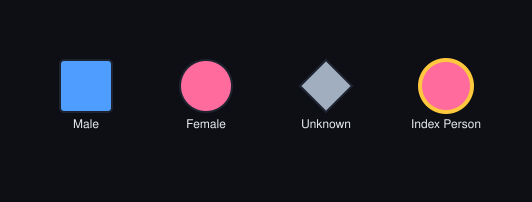
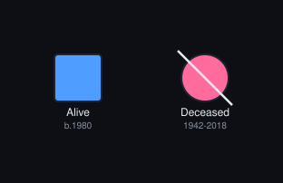
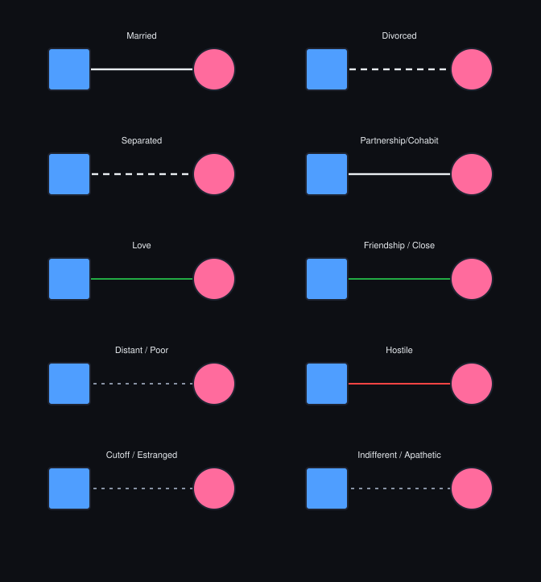
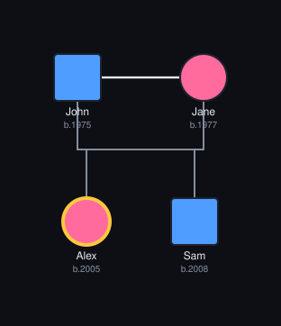
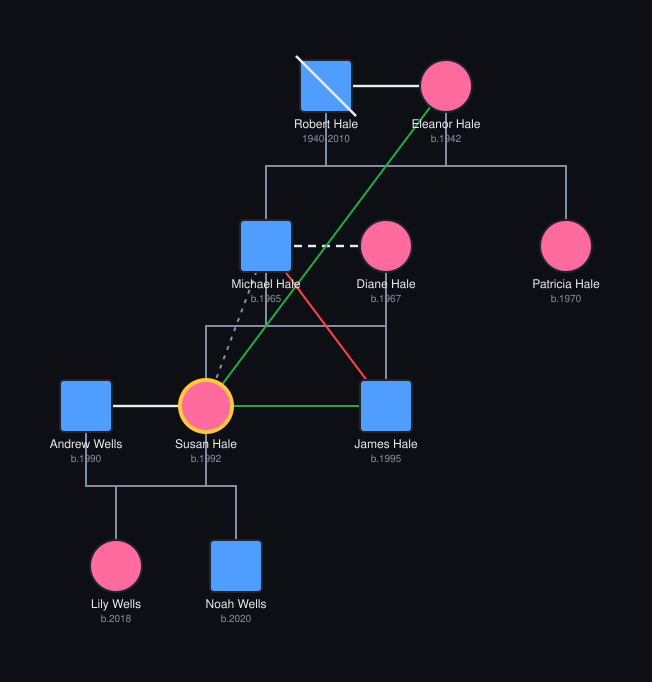

<div align="center">

# Genogram Builder

**A clinical genogram builder implementing the full Bowen standard symbol set.**

*Touch-optimized for Android tablets — with iOS, web, and desktop on the way.*

[](#-license)
[](https://flutter.dev)
[](https://dart.dev)
[](#)

[](https://github.com/melovagabond/genogram_builder/releases)
[](https://github.com/melovagabond/genogram_builder/releases)
[](https://github.com/melovagabond/genogram_builder/releases)
[](https://github.com/melovagabond/genogram_builder/commits/develop)

[](https://github.com/melovagabond/genogram_builder/stargazers)
[](https://github.com/melovagabond/genogram_builder/network/members)
[](https://github.com/melovagabond/genogram_builder/watchers)

[](https://github.com/melovagabond/genogram_builder/issues)
[](https://github.com/melovagabond/genogram_builder/pulls)
[](https://github.com/melovagabond/genogram_builder/pulls?q=is%3Apr+is%3Aclosed)
[](https://github.com/melovagabond/genogram_builder/graphs/contributors)
[](#-contributing)

[](https://github.com/melovagabond/genogram_builder)
[](https://github.com/melovagabond/genogram_builder)
[](https://github.com/melovagabond/genogram_builder)
[](https://github.com/melovagabond/genogram_builder/pulse)

</div>

---

## Download — No Git Required

**Want to just use the app?** You don't need to install Git or build from source.

1. Go to the **[Releases page →](https://github.com/melovagabond/genogram_builder/releases)**
2. Click the latest release at the top of the list
3. Scroll down to **Assets** and pick the file for your device:

   | If you're on... | Download this file |
   |---|---|
   | 🤖 **Android phone or tablet** | `app-release.apk` (install by tapping it — you may need to allow "install from unknown sources") |
   | 🍎 **iPhone / iPad** | `Runner.ipa` (requires sideloading — see Apple's instructions) |
   | 🌐 **Anywhere with a browser** | `web.zip` — unzip and open `index.html`, or host it on any static web server |

> 💡 **New to GitHub?** Releases are the green-tagged versions on the right side of the repo page. The "Code" button is for developers; you want **Releases**.

---

## Visual Walkthrough

A quick tour of what the app does. All images below are auto-generated from the
in-app data models by [test/generate_reference_svgs_test.dart](test/generate_reference_svgs_test.dart),
so they stay in sync with the code.

### 1. Add people — three Bowen gender shapes + a gold "index person"

<p align="center">
  
</p>

Tap **+ Male**, **+ Female**, or **+ ?** in the toolbar (or use the **+** FAB
for the expandable quick-add menu). Mark exactly one person as the *index
person* in the edit sheet — they render in gold with a thicker outline and
an `IP` letter below the shape. That is the focal point of the chart.

### 2. Edit a person — birth/death years, markers, notes

<p align="center">
  
</p>

Double-tap any node to open the edit sheet. Set the birth year, death year
(adds the diagonal deceased overlay automatically), gender, generation, notes,
and toggle markers: substance abuse, mental illness, physical illness, abuse
perpetrator/victim, adopted, foster, index person. Long-press for a quick
context menu instead.

### 3. Connect people — structural and emotional ties

<p align="center">
  
</p>

1. Tap **Link** in the toolbar.
2. Tap the source person (orange ring appears).
3. Tap the target person.
4. Pick a relationship type from the bottom sheet — 15+ types across
   *structural* (marriage, divorce, separation, partnership, parent-child),
   *positive* (love, friendship, harmony, fused), *negative* (hostile,
   discord, cutoff, distant), *violence*, *abuse*, and *control* categories.

### 4. Lay out a family — the painter routes couples + children automatically

<p align="center">
  
</p>

When two people are married or partnered, you only need to author the
`parentChild` links to each kid — the painter drops a single descent line
from the midpoint of the couple into a shared sibling bar.

### 5. Auto-layout by generation

Set each person's **Generation** field (`0` = focal, `-1` = parents, `-2` =
grandparents, `1` = children, `2` = grandchildren), then tap **Layout** →
**Fit**. The full demo dataset that ships with the app:

<p align="center">
  
</p>

…and a 2-hop focused view centred on the index person (Susan):

<p align="center">
  
</p>

### 6. Export & import

- **Export JSON** — share/save a `.json` backup of the entire chart.
- **Import JSON** — load any previously exported `.json` (or hand-write one
  using the schema in [Bulk authoring via JSON](#bulk-authoring-via-json)).
- **Export PDF** — opens the native print/share dialog with a rendered PDF
  including a legend strip.

Pan, pinch-zoom, drag nodes, marquee-select groups — all touch-first.

---

## Features

- Full Bowen standard node symbols: male (square), female (circle), unknown (diamond)
- Deceased overlay, pregnancy, miscarriage, abortion, stillbirth, identical/fraternal twins
- Per-person markers: substance abuse, mental illness, physical illness, abuse perpetrator/victim, adopted, foster, **index person** (focal — renders gold)
- 15 relationship line types across structural and emotional categories
- Auto-layout by generation (set generation field per person: 0=focal, -1=parent, 1=child, etc.)
- Pan, pinch-zoom, drag nodes -- touch optimized
- JSON export/import for backup and restore
- PDF export with legend strip
- 200 person maximum (configurable in `genogram_state.dart`)

---

## Getting Started (For Developers)

> Just want to use the app? Skip this — see **[Download — No Git Required](#-download--no-git-required)** above.

### Prerequisites

- Flutter 3.10+
- Dart 3.0+
- For Android: Android SDK / Android Studio
- For iOS: macOS with Xcode 15+

### Install dependencies

```bash
flutter pub get
```

### Run

```bash
# Android
flutter run -d android

# iOS simulator
flutter run -d iPhone

# Web
flutter run -d chrome

# List available devices
flutter devices
```

### Build

```bash
# Android debug APK (no signing needed)
flutter build apk --debug

# Android release APK (requires keystore setup -- see below)
flutter build apk --release

# iOS (no-codesign, for local testing)
flutter build ios --no-codesign

# Web
flutter build web --web-renderer canvaskit
```

---

## GitHub Actions CI/CD

Push a version tag to trigger builds for all platforms:

```bash
git tag v1.0.0
git push origin v1.0.0
```

This triggers the build workflow which:
1. Builds Android APK + AAB
2. Builds iOS IPA (if signing secrets are configured)
3. Builds web bundle
4. Creates a GitHub Release with all artifacts attached

### Required Secrets

Configure these in your repo: **Settings > Secrets and variables > Actions**

#### Android release signing (optional -- debug APK works without)

| Secret | Value |
|--------|-------|
| `ANDROID_KEYSTORE` | Base64-encoded `.jks` keystore file |
| `ANDROID_KEY_ALIAS` | Key alias in the keystore |
| `ANDROID_KEY_PASSWORD` | Key password |
| `ANDROID_STORE_PASSWORD` | Keystore password |

Generate a keystore:
```bash
keytool -genkey -v -keystore release.jks -alias genogram \
  -keyalg RSA -keysize 2048 -validity 10000

# Base64 encode for the secret
base64 -i release.jks | pbcopy
```

#### iOS signing (optional -- unsigned build works without)

| Secret | Value |
|--------|-------|
| `IOS_CERTIFICATE_P12` | Base64-encoded `.p12` distribution certificate |
| `IOS_CERTIFICATE_PASSWORD` | Certificate password |
| `IOS_PROVISIONING_PROFILE` | Base64-encoded `.mobileprovision` ad-hoc profile |

Steps:
1. Create an ad-hoc provisioning profile in Apple Developer portal
2. Download and base64-encode both the `.p12` and `.mobileprovision`
3. Update `ios/ExportOptions.plist` with your team ID and bundle ID
4. Update bundle ID in `ios/Runner/Info.plist`

```bash
# Encode for secrets
base64 -i cert.p12 | pbcopy
base64 -i profile.mobileprovision | pbcopy
```

---

## Project Structure

```
lib/
  main.dart                    # Entry point, Provider setup
  models/
    person.dart                # Person data model + markers
    relationship.dart          # Relationship model + all Bowen types
    genogram_state.dart        # Top-level state container
  providers/
    genogram_provider.dart     # Single ChangeNotifier -- all state mutations
  painters/
    node_painter.dart          # CustomPainter for person nodes
    relation_painter.dart      # CustomPainter for relationship lines
  widgets/
    canvas_widget.dart         # Main canvas + gesture handling + edit sheets
    relationship_picker.dart   # Bottom sheet for selecting relationship type
    toolbar.dart               # (unused -- app bar built in main_screen)
  screens/
    main_screen.dart           # Root scaffold, app bar, FAB, status bar
  services/
    export_service.dart        # PDF export via pdf + printing packages
    json_export_service.dart   # JSON export via share_plus
    import_service.dart        # JSON import via file_picker
  constants/
    app_theme.dart             # Colors, sizing constants, ThemeData
```

---

## Usage

### Adding people

- Toolbar buttons: `+ Male`, `+ Female`, `+ ?`
- Or tap the `+` FAB (bottom right) for the expandable quick-add menu

### Editing a person

- Double-tap any node to open the edit sheet
- Or long-press for the context menu

### Connecting people

1. Tap **Link** in the toolbar
2. Tap the source person (orange ring appears)
3. Tap the target person
4. Pick relationship type from the bottom sheet

### Auto-layout

1. Set the **Generation** field for each person (0 = focal generation, -1 = parents, -2 = grandparents, 1 = children, 2 = grandchildren)
2. Tap **Layout** in toolbar
3. Tap **Fit** to zoom to fit the result

### Export/Import

- **Export JSON**: shares the genogram as a `.json` file (use as backup)
- **Import JSON**: opens file picker, loads a previously exported `.json`
- **Export PDF**: opens the print/share dialog with a rendered PDF

---

## Bulk authoring via JSON

The fastest way to seed a large family is to hand-write a JSON file, import it,
then drag the nodes into place (or hit **Layout** + **Fit**). Use the schema
below.

### Top-level

```jsonc
{
  "version": 1,
  "nextId": 100,                // any int larger than your largest used id
  "persons": { "p1": { ... }, "p2": { ... } },
  "relationships": { "r1": { ... }, "r2": { ... } }
}
```

`persons` and `relationships` are objects keyed by id. The key MUST match the
`id` field inside the object.

### Person object

```jsonc
{
  "id": "p1",
  "name": "Alice Smith",
  "gender": "female",           // "male" | "female" | "unknown"
  "birthYear": 1980,            // int or null
  "deathYear": null,            // int or null
  "generation": 0,              // 0 = focal, -1 = parents, 1 = children, ...
  "specialType": "none",        // "none" | "pregnancy" | "miscarriage"
                                // | "abortion" | "stillbirth"
                                // | "twinMono" | "twinDi"
  "markers": {
    "substance": false,
    "mental": false,
    "physical": false,
    "abusePerpetrator": false,
    "abuseVictim": false,
    "adopted": false,
    "foster": false,
    "indexPerson": false        // <-- the "main focus" (you). Renders GOLD.
  },
  "notes": "",
  "x": 0,                       // world coordinates (px). 0,0 is fine; use
  "y": 0                        // Layout/Fit later, or drag to organize.
}
```

#### The index person (main focus)

Set `markers.indexPerson: true` on the person who is the focal point of the
chart (typically the client / "you"). That node:

- Renders in **gold** (`#FFC83D`) instead of the gender color
- Has a thicker outline
- Shows an `IP` marker letter below the shape
- Should appear on **exactly one** person

The gender shape (square / circle / diamond) is still preserved.

### Relationship object

```jsonc
{
  "id": "r1",
  "sourceId": "p1",
  "targetId": "p2",
  "type": "married",            // see full list below
  "notes": ""
}
```

#### Structural relationship types

| `type` value     | Meaning                                    |
|------------------|--------------------------------------------|
| `married`        | Marriage (solid horizontal line)           |
| `partnership`    | Partnership / Cohabitation                 |
| `engaged`        | Engaged                                    |
| `separated`      | Separated                                  |
| `divorced`       | Divorced                                   |
| `parentChild`    | Parent (source) -> Child (target)          |
| `sibling`        | Siblings (no shared-parent requirement)    |

#### Emotional / clinical types

`plain`, `indifferent`, `distant`, `cutoff`, `harmony`, `friendship`, `love`,
`inLove`, `fused`, `distrust`, `hostile`, `distantHostile`, `closeHostile`,
`fusedHostile`, `discord`, `violence`, `distantViolence`, `closeViolence`,
`fusedViolence`, `abuse`, `physicalAbuse`, `emotionalAbuse`, `sexualAbuse`,
`neglect`, `manipulative`, `controlling`, `jealous`, `focusedOn`, `fanAdmirer`,
`limerence`, `neverMet`, `other`.

### Patterns to build a family

**Marriage / partnership** — one relationship between the two partners:

```json
{ "id": "r1", "sourceId": "dad", "targetId": "mom", "type": "married", "notes": "" }
```

**Parent -> child** — one relationship per parent-child link. If both parents
are present and married/partnered, the painter automatically routes the child
line down from the midpoint of the couple, so you only need to author the
parent-child links themselves:

```json
{ "id": "r2", "sourceId": "dad", "targetId": "kid1", "type": "parentChild", "notes": "" },
{ "id": "r3", "sourceId": "mom", "targetId": "kid1", "type": "parentChild", "notes": "" }
```

**Siblings** — author an explicit `sibling` link between each pair, OR rely on
shared parents (the painter draws a sibling bar across children of the same
couple automatically). For half-siblings or sibling groups without shared
parents in the file, use explicit `sibling` links. When three or more siblings
share an `sibling` graph, they get a single shared sibling bar rather than a
mess of crossing lines.

**Twins** — set both children's `specialType` to `twinMono` (identical) or
`twinDi` (fraternal), and link both to the same parent(s) with `parentChild`.

### Minimal worked example

A nuclear family of four with the daughter as the index person:

```json
{
  "version": 1,
  "nextId": 10,
  "persons": {
    "dad":  { "id": "dad",  "name": "John",   "gender": "male",
              "birthYear": 1975, "deathYear": null, "generation": -1,
              "specialType": "none", "notes": "", "x": 0,   "y": 0,
              "markers": { "substance": false, "mental": false, "physical": false,
                           "abusePerpetrator": false, "abuseVictim": false,
                           "adopted": false, "foster": false, "indexPerson": false } },
    "mom":  { "id": "mom",  "name": "Jane",   "gender": "female",
              "birthYear": 1977, "deathYear": null, "generation": -1,
              "specialType": "none", "notes": "", "x": 120, "y": 0,
              "markers": { "substance": false, "mental": false, "physical": false,
                           "abusePerpetrator": false, "abuseVictim": false,
                           "adopted": false, "foster": false, "indexPerson": false } },
    "you":  { "id": "you",  "name": "Alex",   "gender": "female",
              "birthYear": 2005, "deathYear": null, "generation": 0,
              "specialType": "none", "notes": "", "x": 30,  "y": 160,
              "markers": { "substance": false, "mental": false, "physical": false,
                           "abusePerpetrator": false, "abuseVictim": false,
                           "adopted": false, "foster": false, "indexPerson": true } },
    "sib":  { "id": "sib",  "name": "Sam",    "gender": "male",
              "birthYear": 2008, "deathYear": null, "generation": 0,
              "specialType": "none", "notes": "", "x": 150, "y": 160,
              "markers": { "substance": false, "mental": false, "physical": false,
                           "abusePerpetrator": false, "abuseVictim": false,
                           "adopted": false, "foster": false, "indexPerson": false } }
  },
  "relationships": {
    "r1": { "id": "r1", "sourceId": "dad", "targetId": "mom", "type": "married",     "notes": "" },
    "r2": { "id": "r2", "sourceId": "dad", "targetId": "you", "type": "parentChild", "notes": "" },
    "r3": { "id": "r3", "sourceId": "mom", "targetId": "you", "type": "parentChild", "notes": "" },
    "r4": { "id": "r4", "sourceId": "dad", "targetId": "sib", "type": "parentChild", "notes": "" },
    "r5": { "id": "r5", "sourceId": "mom", "targetId": "sib", "type": "parentChild", "notes": "" }
  }
}
```

Save it as `family.json`, hit **Import JSON** in the menu, then **Layout** →
**Fit**. The daughter renders gold as the index person; the couple share a
single descent line into the sibling bar.

### Tips

- Every person id used in a relationship MUST exist in `persons`.
- Coordinates (`x`, `y`) can all be `0` — just hit **Layout** + **Fit** after
  import, or drag-organize by hand.
- Set `nextId` higher than any numeric id you used so the in-app auto-id
  generator doesn't collide.
- Use the **Select** marquee tool to grab multiple imported nodes and drag
  them as a group.

---

## Configuration

Change the max node limit in `lib/models/genogram_state.dart`:

```dart
static const int maxNodes = 200;
```

---

## 🤝 Contributing

Contributions are warmly welcomed — whether it's a typo fix, a new relationship type, a bug report, or a brand-new feature.

### I found a bug / have an idea

Open an **[Issue](https://github.com/melovagabond/genogram_builder/issues/new/choose)**. No special format required — just describe what happened (or what you'd like to see). Screenshots help a lot.

### I want to submit a code change

If you've never contributed to an open-source project before, here's the quick path:

1. **Fork** this repo — click the "Fork" button at the top right of the GitHub page.
2. **Clone** your fork to your computer:
   ```bash
   git clone https://github.com/YOUR-USERNAME/genogram_builder.git
   cd genogram_builder
   ```
3. **Create a branch** for your change:
   ```bash
   git checkout -b my-cool-fix
   ```
4. **Make your changes**, then run:
   ```bash
   flutter pub get
   flutter analyze
   flutter test
   ```
5. **Commit & push**:
   ```bash
   git add .
   git commit -m "Describe what you changed"
   git push origin my-cool-fix
   ```
6. **Open a Pull Request** — go to your fork on GitHub and click "Compare & pull request". Describe what you changed and why.

### Guidelines

- Keep PRs focused — one feature or fix per PR is easier to review.
- Match the existing code style; `flutter format .` before committing.
- If you're adding a new Bowen symbol or relationship type, please cite the clinical reference in the PR.
- Be kind in reviews and discussion. 💛

---

## License

This project is licensed under the **MIT License** — one of the most permissive open-source licenses available. In short:

✅ You can **use** it (personal, commercial, clinical, whatever)
✅ You can **modify** it
✅ You can **distribute** it
✅ You can **sublicense** it
⚠️ You must include the original copyright and license notice
❌ The software is provided "as is" — no warranty

See the full text in [LICENSE](LICENSE).

```
Copyright (c) 2026 Daevon C. Branche
MIT License — see LICENSE file for full terms.
```

---

<div align="center">

**Built with ❤️ and Flutter.**

If this project helps you, consider starring it on [GitHub](https://github.com/melovagabond/genogram_builder) ⭐

</div>
